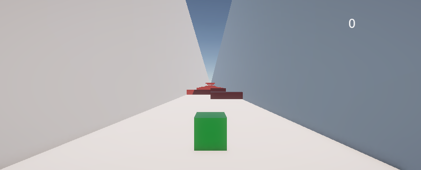
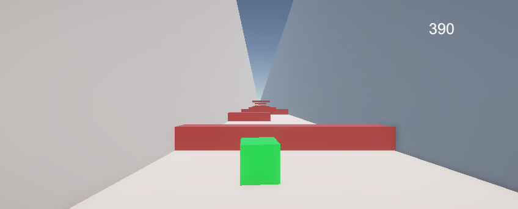
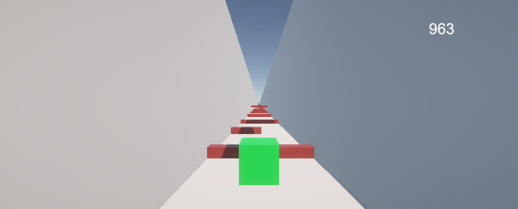
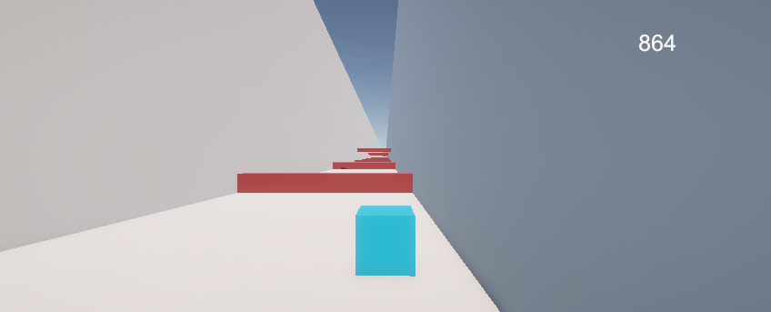

# UnityCubeGame
The game for my Portfolio
# Description

In UnityCubeGame, you take control of a vibrant green cube, propelled forward by the game’s relentless momentum in a thrilling cube-based twist on the classic "Temple Run" style! Your mission is to dodge the menacing red obstacles that block your path. Adapt to the challenge with dynamic color shifts: press "E" to transform your cube into Blue for a massive leap, Orange for a speed boost, or Purple to reduce gravity and levitate gracefully. With only 3 levels for this demo version, it’s a compact yet exciting showcase of unique mechanics and potential for expansion!

# Screenshots

